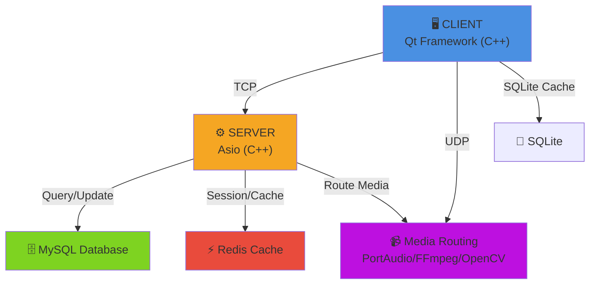

# 💬 Chatties

> **A Modern Chat App Inspired by Discord**

---

Welcome to **Chatties** — a sleek, feature-rich communication platform inspired by the best of Discord. Chatties is designed for communities, friends, and teams who want a seamless, interactive, and customizable chat experience.

## ✨ Features

- **Create and join servers** for organized group conversations
- **Text and media channels** for sharing messages, images, and files
- **Real-time messaging** with instant updates
- **Voice and video chat** with crystal-clear audio/video quality
- **User roles and permissions** for safe and flexible management
- **Modern, intuitive interface** for effortless navigation

## 🚀 Why Chatties?

Chatties brings people together in a dynamic, secure, and scalable environment. Whether you're building a community, collaborating on projects, or just hanging out, Chatties makes online communication easy and enjoyable.

---

## 📚 Tech Stack

### Networking Protocols
- **TCP** - Reliable message delivery for text communication
- **UDP** - Low-latency protocol for voice/video streaming

### Server-Side Technologies
| Component | Technology | Purpose |
|-----------|-----------|---------|
| **Core Framework** | C++ | High-performance server implementation |
| **Network I/O** | Asio | Asynchronous networking library |
| **Audio Processing** | PortAudio | Voice chat audio capture & playback |
| **Computer Vision** | OpenCV | Real-time video processing & streaming |
| **Video Encoding** | FFmpeg | Video capture, encoding & transcoding |

### Client-Side Technologies
| Component | Technology | Purpose |
|-----------|-----------|---------|
| **UI Framework** | Qt (C++) | Cross-platform desktop client |
| **Local Storage** | SQLite | Client-side caching & offline support |

### Backend Infrastructure
| Component | Technology | Purpose |
|-----------|-----------|---------|
| **Primary Database** | MySQL | Persistent user data, messages, servers |
| **Cache Layer** | Redis | Session management, real-time data caching |
| **Local Cache** | SQLite | Server-side temporary data storage |

---

## 🏗️ Project Structure

```
App_Chatties/
├── src/
│   ├── server/
│   │   ├── core/
│   │   │   ├── asio_server.cpp
│   │   │   ├── asio_server.h
│   │   │   ├── connection_manager.cpp
│   │   │   └── connection_manager.h
│   │   ├── handlers/
│   │   │   ├── message_handler.cpp
│   │   │   ├── message_handler.h
│   │   │   ├── user_handler.cpp
│   │   │   └── user_handler.h
│   │   ├── media/
│   │   │   ├── audio_processor.cpp
│   │   │   ├── audio_processor.h
│   │   │   ├── video_processor.cpp
│   │   │   └── video_processor.h
│   │   └── main.cpp
│   ├── client/
│   │   ├── ui/
│   │   │   ├── main_window.cpp
│   │   │   ├── main_window.h
│   │   │   ├── chat_widget.cpp
│   │   │   └── chat_widget.h
│   │   ├── network/
│   │   │   ├── socket_client.cpp
│   │   │   ├── socket_client.h
│   │   │   └── protocol_handler.cpp
│   │   ├── media/
│   │   │   ├── audio_manager.cpp
│   │   │   ├── audio_manager.h
│   │   │   ├── video_manager.cpp
│   │   │   └── video_manager.h
│   │   └── main.cpp
│   └── common/
│       ├── protocol/
│       │   ├── message_protocol.h
│       │   └── packet_definitions.h
│       ├── utils/
│       │   ├── logger.cpp
│       │   ├── logger.h
│       │   ├── serializer.cpp
│       │   └── serializer.h
│       └── constants.h
├── database/
│   ├── schemas/
│   │   ├── users.sql
│   │   ├── servers.sql
│   │   ├── channels.sql
│   │   ├── messages.sql
│   │   └── permissions.sql
│   └── migrations/
│       └── README.md
├── config/
│   ├── server_config.json
│   ├── client_config.json
│   └── database_config.json
├── build/
│   └── CMakeFiles/
├── docs/
│   ├── ARCHITECTURE.md
│   ├── API.md
│   ├── SETUP.md
│   └── DEVELOPMENT.md
├── CMakeLists.txt
├── vcpkg.json
└── README.md
```

---

## 🔧 Architecture Overview



---

## 📋 How to Setup & Run

### Prerequisites
- C++ 17 or higher
- CMake 3.20+
- Visual Studio 2019+ or GCC 9+
- vcpkg for dependency management
- MySQL Server
- Redis Server
- Qt 6.0+ (for client)

### Installation

1. **Clone the repository:**
```sh
git clone https://github.com/Khoi2310/App_Chatties.git
cd App_Chatties
```

2. **Install vcpkg dependencies:**
```sh
.\vcpkg\vcpkg.exe install asio:x64-windows nlohmann-json:x64-windows sqlite3:x64-windows portaudio:x64-windows opencv:x64-windows ffmpeg:x64-windows --triplet=x64-windows
```

3. **Configure the project:**
```sh
mkdir build
cd build
cmake .. -DCMAKE_TOOLCHAIN_FILE=../vcpkg/scripts/buildsystems/vcpkg.cmake -DCMAKE_BUILD_TYPE=Release
```

4. **Build the project:**
```sh
cmake --build . --config Release
```

5. **Setup databases:**
- Create MySQL database: `mysql -u root -p < ../database/schemas/users.sql`
- Ensure Redis server is running on default port 6379

6. **Run the server:**
```sh
.\Release\ServerApp.exe
```

7. **Run the client:**
```sh
.\Release\ClientApp.exe
```

---

## 💡 Development

For detailed development setup and guidelines, see [DEVELOPMENT.md](docs/DEVELOPMENT.md).

### Building with VS Code
- Install the **CMake Tools** extension
- Use the CMake tab at the bottom to configure and build with one click

### Contributing
Contributions are welcome! Please follow our coding standards and submit pull requests for review.

---

## 📝 License

This project is licensed under the MIT License - see the LICENSE file for details.

---

Start chatting, sharing, and connecting — all in one place with **Chatties**!
