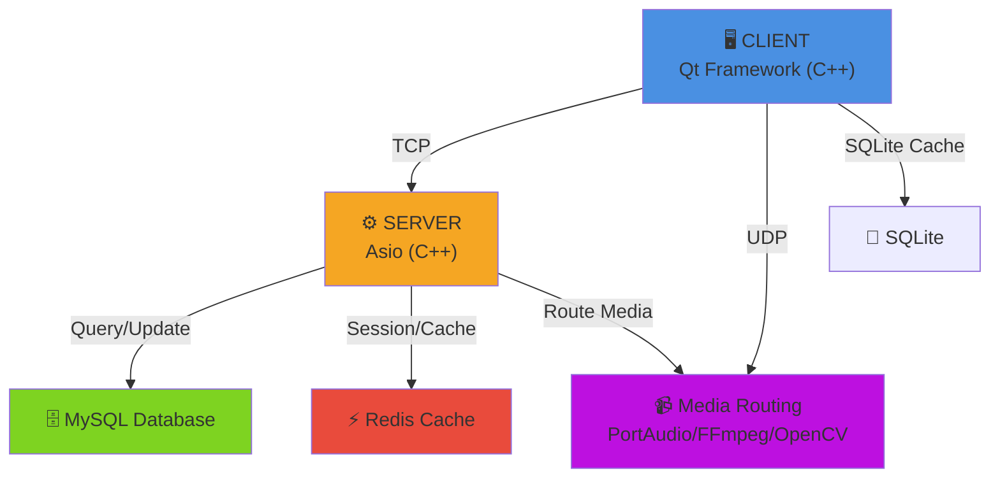

# 💬 Chatties

> **A Modern Chat App Inspired by Discord**

---

Welcome to **Chatties** — a sleek, feature-rich communication platform inspired by the best of Discord. Chatties is designed for communities, friends, and teams who want a seamless, interactive, and customizable chat experience.

## ✨ Features

- **Create and join servers** for organized group conversations
- **Text and media channels** for sharing messages, images, and files
- **Real-time messaging** with instant updates
- **Voice and video chat** with crystal-clear audio/video quality
- **User roles and permissions** for safe and flexible management
- **Modern, intuitive interface** for effortless navigation

## 🚀 Why Chatties?

Chatties brings people together in a dynamic, secure, and scalable environment. Whether you're building a community, collaborating on projects, or just hanging out, Chatties makes online communication easy and enjoyable.


---

## 🚀 Quick Start (Windows)

**One command** builds the server + client and launches them.

### Prerequisites (install once)
- **Visual Studio 2022** with the *Desktop development with C++* workload (MSVC)
- **CMake** 3.16+ (bundled with VS, or standalone)
- **vcpkg** — clone it, run `bootstrap-vcpkg.bat`, and set the `VCPKG_ROOT` environment variable to its folder
- **Qt 6.11** for **MSVC 2022 64-bit** (via the Qt Online Installer)

### Run it
```powershell
git clone https://github.com/Khoi2310/App_Chatties.git
cd App_Chatties
./launch.ps1
```

`launch.ps1` will:
1. create `Code/server_config.json` from the template,
2. configure + build the **server** — *the first run compiles the vcpkg dependencies (Boost, OpenSSL, SQLite, libsodium, cpp-httplib) and can take 10–30+ minutes; later runs are incremental*,
3. configure + build the **client** (Qt),
4. copy the Qt runtime next to the client exe (`windeployqt`),
5. launch the server, then the client.

**Options**
- `./launch.ps1 -QtDir "C:\Qt\6.11.1\msvc2022_64"` — if Qt isn't auto-detected under `C:\Qt`
- `./launch.ps1 -Clean` — wipe build folders first (forces a fresh QML cache)
- `./launch.ps1 -NoRun` — build + deploy only, don't launch

Then **register an account** in the client to begin. To try multi-user features (DMs, mentions, reactions), just run `Code\Chatties\build\Debug\Chatties.exe` again for a second account — both clients talk to the same local server.

> The GIF picker needs a free [Giphy API key](https://developers.giphy.com/) — paste it into `Code/server_config.json

---

## 📚 Tech Stack

### Networking Protocols
- **TCP** - Reliable message delivery for text communication
- **UDP** - Low-latency protocol for voice/video streaming

### Server-Side Technologies
| Component | Technology | Purpose |
|-----------|-----------|---------|
| **Core Framework** | C++ | High-performance server implementation |
| **Network I/O** | Asio | Asynchronous networking library |
| **Audio Processing** | PortAudio | Voice chat audio capture & playback |
| **Computer Vision** | OpenCV | Real-time video processing & streaming |
| **Video Encoding** | FFmpeg | Video capture, encoding & transcoding |

### Client-Side Technologies
| Component | Technology | Purpose |
|-----------|-----------|---------|
| **UI Framework** | Qt (C++) | Cross-platform desktop client |
| **Local Storage** | SQLite | Client-side caching & offline support |

### Backend Infrastructure
| Component | Technology | Purpose |
|-----------|-----------|---------|
| **Primary Database** | MySQL | Persistent user data, messages, servers |
| **Cache Layer** | Redis | Session management, real-time data caching |
| **Local Cache** | SQLite | Server-side temporary data storage |

---

## 🏗️ Project Structure

> This is the **target** layout. Today the buildable code lives under `Code/`
> (`Code/CMakeLists.txt`, `Code/vcpkg.json`, `Code/src/`, and the Qt client in
> `Code/Chatties/`), with vcpkg used in manifest mode via a system-installed
> toolchain. The media, database, config, and docs folders below are planned.

```
App_Chatties/
├── src/
│   ├── server/
│   │   ├── core/
│   │   │   ├── asio_server.cpp
│   │   │   ├── asio_server.h
│   │   │   ├── connection_manager.cpp
│   │   │   └── connection_manager.h
│   │   ├── handlers/
│   │   │   ├── message_handler.cpp
│   │   │   ├── message_handler.h
│   │   │   ├── user_handler.cpp
│   │   │   └── user_handler.h
│   │   ├── media/
│   │   │   ├── audio_processor.cpp
│   │   │   ├── audio_processor.h
│   │   │   ├── video_processor.cpp
│   │   │   └── video_processor.h
│   │   └── main.cpp
│   ├── client/
│   │   ├── ui/
│   │   │   ├── main_window.cpp
│   │   │   ├── main_window.h
│   │   │   ├── chat_widget.cpp
│   │   │   └── chat_widget.h
│   │   ├── network/
│   │   │   ├── socket_client.cpp
│   │   │   ├── socket_client.h
│   │   │   └── protocol_handler.cpp
│   │   ├── media/
│   │   │   ├── audio_manager.cpp
│   │   │   ├── audio_manager.h
│   │   │   ├── video_manager.cpp
│   │   │   └── video_manager.h
│   │   └── main.cpp
│   └── common/
│       ├── protocol/
│       │   ├── message_protocol.h
│       │   └── packet_definitions.h
│       ├── utils/
│       │   ├── logger.cpp
│       │   ├── logger.h
│       │   ├── serializer.cpp
│       │   └── serializer.h
│       └── constants.h
├── database/
│   ├── schemas/
│   │   ├── users.sql
│   │   ├── servers.sql
│   │   ├── channels.sql
│   │   ├── messages.sql
│   │   └── permissions.sql
│   └── migrations/
│       └── README.md
├── config/
│   ├── server_config.json
│   ├── client_config.json
│   └── database_config.json
├── build/
│   └── CMakeFiles/
├── docs/
│   ├── ARCHITECTURE.md
│   ├── API.md
│   ├── SETUP.md
│   └── DEVELOPMENT.md
├── CMakeLists.txt
├── vcpkg.json
└── README.md
```

---

## 🔧 Architecture Overview



---

## 📋 How to Setup & Run

> The features above are the project's roadmap. What currently builds is the
> **Boost.Asio TCP server** (`Code/`) and the **Qt 6 GUI client** (`Code/Chatties/`).
> C++ dependencies are handled by vcpkg in manifest mode (`Code/vcpkg.json`), pinned
> to a `builtin-baseline`. The build uses a separately installed vcpkg toolchain
> referenced through `VCPKG_ROOT` or `CMAKE_TOOLCHAIN_FILE`.

### Prerequisites
- **Git**
- **CMake** 3.21+
- A **C++17 compiler** — Visual Studio 2022 / VS 2022 Build Tools (MSVC) on Windows
- **Qt 6** (only for the client) — `Core`, `Widgets`, `Network`, `Sql`

> The server links the Winsock libraries (`ws2_32` / `mswsock`) and is Windows-oriented.
> No extension or IDE is required — these are plain command-line steps.

### 1. Clone the repo
```sh
git clone https://github.com/Khoi2310/App_Chatties.git
cd App_Chatties
```

### 2. Install vcpkg (once)
If you don't already have vcpkg installed, install it separately and bootstrap it:
```powershell
git clone https://github.com/Microsoft/vcpkg.git 
cd E:\LTM\Project\App_Chatties\vcpkg
.\bootstrap-vcpkg.bat
cd ..\Code
mkdir build
cd build
cmake .. -DCMAKE_TOOLCHAIN_FILE="E:/LTM/Project/App_Chatties/vcpkg/scripts/buildsystems/vcpkg.cmake"
```

### 3. Build the server (`ServerApp`)
```powershell
cd Code
cmake --preset default
cmake --build build
```
The first configure installs Boost / nlohmann-json / sqlite3 from the manifest and
takes a few minutes (Boost compiles from source). The binary lands in `Code/build/`.

### 4. Build the Qt client (`Chatties`)
The client uses Qt, not vcpkg — point CMake at your Qt kit:
```powershell
cd Code/Chatties
cmake -B build -S . -DCMAKE_PREFIX_PATH="D:\Qt\6.11.1\msvc2022_64"
cmake --build build
```

### 5. Run
Start the server, then the client (the client connects to `127.0.0.1:8080`):
```powershell
.\build\Debug\ServerApp.exe
.\build\Debug\Chatties.exe
```

> **Stop the server before rebuilding.** It runs an infinite loop, and a running
> `ServerApp.exe` locks the `build/` folder on Windows.

---

## 💡 Development

For detailed development setup and guidelines, see [DEVELOPMENT.md](docs/DEVELOPMENT.md).

### Building from the command line
The project builds with plain CMake — no IDE extension needed:
```powershell
cd Code
cmake --preset default      # configure (uses the system vcpkg toolchain via VCPKG_ROOT)
cmake --build build         # compile
```
If you use the VS Code **CMake Tools** extension, set its source directory to
`Code` (the `CMakeLists.txt` lives there, not at the repo root) so it doesn't
create a stray `build/` folder at the top level.

### Updating dependency versions
Run `vcpkg x-update-baseline` inside `Code/` and commit the updated `vcpkg.json`.

### Contributing
Contributions are welcome! Please follow our coding standards and submit pull requests for review.

---

## 📝 License

This project is licensed under the MIT License - see the LICENSE file for details.

---

Start chatting, sharing, and connecting — all in one place with **Chatties**!

