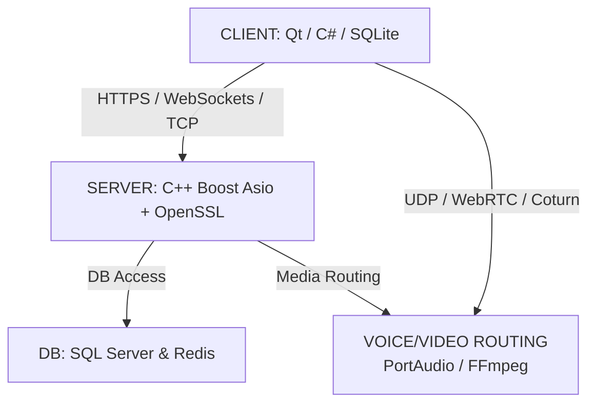

# 💬 Chatties

> **A Modern Chat App Inspired by Discord**

---

Welcome to **Chatties** — a sleek, feature-rich communication platform inspired by the best of Discord. Chatties is designed for communities, friends, and teams who want a seamless, interactive, and customizable chat experience.

## ✨ Features

- **Create and join servers** for organized group conversations
- **Text and media channels** for sharing messages, images, and files
- **Real-time messaging** with instant updates
- **User roles and permissions** for safe and flexible management
- **Modern, intuitive interface** for effortless navigation

## 🚀 Why Chatties?

Chatties brings people together in a dynamic, secure, and scalable environment. Whether you’re building a community, collaborating on projects, or just hanging out, Chatties makes online communication easy and enjoyable.

---

Start chatting, sharing, and connecting — all in one place with **Chatties**!
[Architecture Overview]



Textual Structure:

	[ CLIENT: Qt / C# / SQLite ]
		   │
		   ├─( HTTPS / WebSockets / TCP )─► [ SERVER: C++ Asio + OpenSSL ] ──► [ DB: MySQL & Redis ]
		   │                                       │
		   └─( UDP / WebRTC / Coturn ) ────────────┴─► [ VOICE/VIDEO ROUTING ] (PortAudio / FFmpeg)

This diagram represents the high-level architecture:
- **Client**: Built with Qt or C#, using SQLite for local storage.
- **Server**: C++ backend using Boost Asio and OpenSSL for secure communication.
- **Database**: SQL Server and Redis for persistent and in-memory data.
- **Voice/Video Routing**: Handles media streams using PortAudio and FFmpeg, with UDP/WebRTC/Coturn for real-time communication.


## 🔧 How to Run

### Prerequisites
- Visual Studio Build Tools or MSVC Compiler
- CMake 3.15+
- vcpkg (for dependency management)

### Setup & Build

1. **Clone the repository:**
   ```sh
   git clone https://github.com/Khoi2310/App_Chatties.git
   cd App_Chatties
   ```

2. **Install dependencies (first time only):**
   ```sh
   .\vcpkg\vcpkg.exe install boost-asio:x64-windows nlohmann-json:x64-windows sqlite3:x64-windows
   ```

3. **Configure the project:**
   ```sh
   mkdir build
   cd build
   cmake .. -DCMAKE_TOOLCHAIN_FILE=../vcpkg/scripts/buildsystems/vcpkg.cmake -G "Visual Studio 17 2022"
   ```

4. **Build the project:**
   ```sh
   cmake --build . --config Debug
   ```

5. **Run the server:**
   ```sh
   .\Debug\ServerApp.exe
   ```

### Using VS Code (Recommended)
1. Install the **CMake Tools** extension for VS Code
2. Open the project folder in VS Code
3. Click the **Build** button in the CMake sidebar (or press `F7`)
4. Click the **Run** button or press `Ctrl+F5` to launch the server
5. The server will start listening on port **12345**

### Troubleshooting
- **Build errors**: Ensure `VCPKG_ROOT` environment variable is set or CMake toolchain file path is correct
- **Include not found**: Run `vcpkg install` to install missing dependencies
- **Port in use**: Change the port in `main.cpp` if port 12345 is already in use