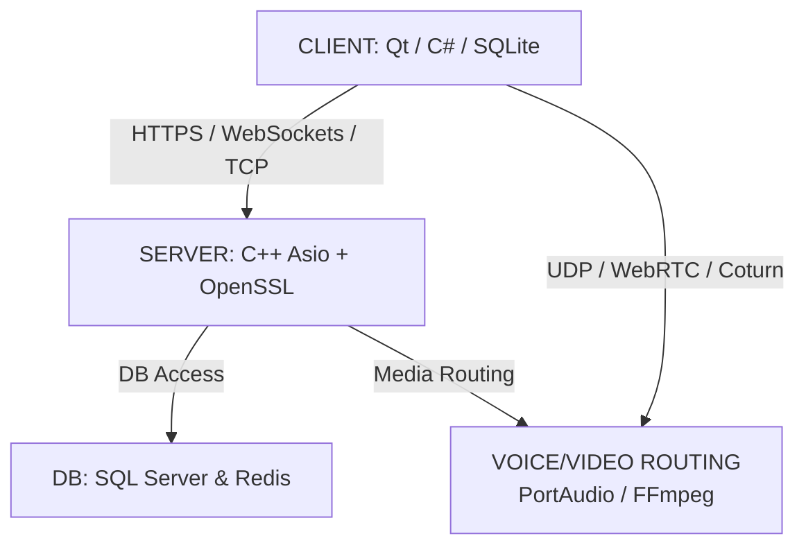

# 💬 Chatties

> **A Modern Chat App Inspired by Discord**

---

Welcome to **Chatties** — a sleek, feature-rich communication platform inspired by the best of Discord. Chatties is designed for communities, friends, and teams who want a seamless, interactive, and customizable chat experience.

## ✨ Features

- **Create and join servers** for organized group conversations
- **Text and media channels** for sharing messages, images, and files
- **Real-time messaging** with instant updates
- **User roles and permissions** for safe and flexible management
- **Modern, intuitive interface** for effortless navigation

## 🚀 Why Chatties?

Chatties brings people together in a dynamic, secure, and scalable environment. Whether you’re building a community, collaborating on projects, or just hanging out, Chatties makes online communication easy and enjoyable.

---

Start chatting, sharing, and connecting — all in one place with **Chatties**!
[Architecture Overview]



Textual Structure:

	[ CLIENT: Qt / C# / SQLite ]
		   │
		   ├─( HTTPS / WebSockets / TCP )─► [ SERVER: C++ Asio + OpenSSL ] ──► [ DB: SQL Server & Redis ]
		   │                                       │
		   └─( UDP / WebRTC / Coturn ) ────────────┴─► [ VOICE/VIDEO ROUTING ] (PortAudio / FFmpeg)

This diagram represents the high-level architecture:
- **Client**: Built with Qt or C#, using SQLite for local storage.
- **Server**: C++ backend using Asio and OpenSSL for secure communication.
- **Database**: SQL Server and Redis for persistent and in-memory data.
- **Voice/Video Routing**: Handles media streams using PortAudio and FFmpeg, with UDP/WebRTC/Coturn for real-time communication.


[How to Run]

1. Clone the repository:
	```sh
	git clone https://github.com/Khoi2310/App_Chatties.git
	cd App_Chatties
	```

2. Install vcpkg (if not already installed):
	```sh
	git clone https://github.com/microsoft/vcpkg.git
	cd vcpkg
	.\bootstrap-vcpkg.bat
	cd ..
	```

3. Install dependencies:
	```sh
	.\vcpkg\vcpkg.exe install asio:x64-windows nlohmann-json:x64-windows sqlite3:x64-windows
	```

4. Configure and build the project with CMake:
	```sh
	mkdir build
	cd build
	cmake .. -DCMAKE_TOOLCHAIN_FILE=../vcpkg/scripts/buildsystems/vcpkg.cmake
	cmake --build .
	```

5. Run the server:
	```sh
	.\Debug\ServerApp.exe
	```

---
**Tip:** If you are using Visual Studio Code, you can use the **CMake Tools** extension (look for the CMake tab at the bottom of the window) to configure, build, and run the project with one click. This is the recommended way for a smooth experience.

If you encounter issues with dependencies, ensure your vcpkg path and CMake toolchain file are correct.